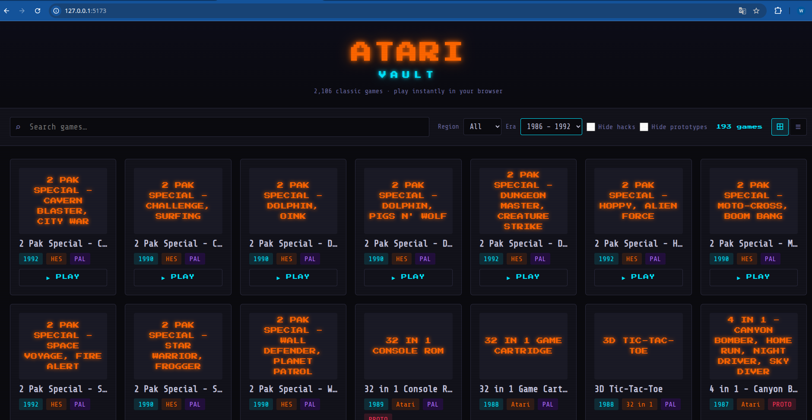
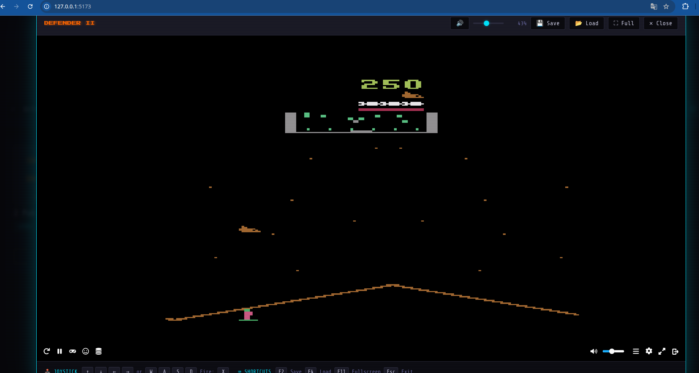
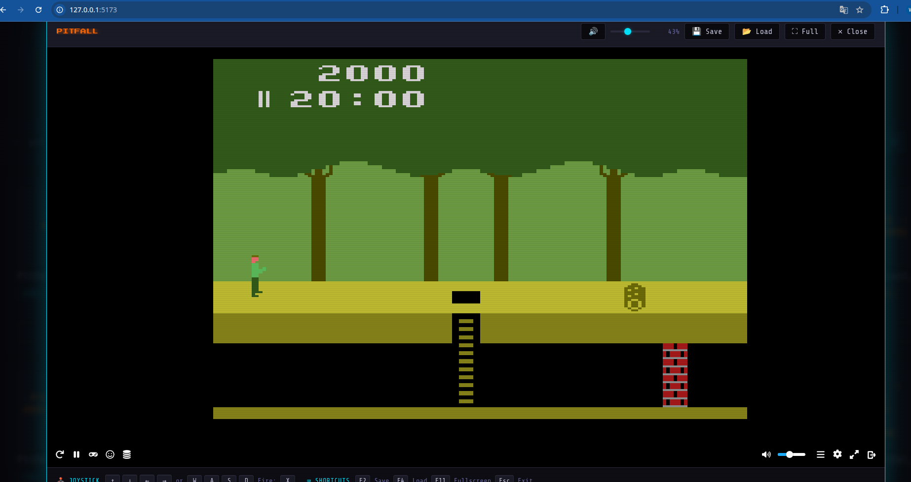

# Atari Vault — 2600 Web Emulator

Entusiastas de jogos retrô, preparem-se para uma viagem nostálgica! O **Atari Vault** é um emulador web que traz mais de **2.100 jogos clássicos do Atari 2600** diretamente para o seu navegador. Desenvolvido com a tecnologia de ponta do [EmulatorJS](https://emulatorjs.org/) (WebAssembly), este projeto permite que você jogue seus títulos favoritos sem a necessidade de instalar qualquer software adicional ou plugins.

---

## Screenshots

### Portal



### Exemplos de jogos

| Defender | Pitfall! |
|:---:|:---:|
|  |  |

### Vídeo de demonstração

https://github.com/user-attachments/assets/games-retro-atari.mp4

> Caso o vídeo não carregue acima, acesse diretamente: [media/games-retro-atari.mp4](media/games-retro-atari.mp4)

## Funcionalidades

- 🎮 **Catálogo completo** — 2.106 ROMs da coleção ROM Hunter V18
- 🔍 **Busca e filtros** — por título, região (NTSC / PAL / SECAM), era e flags
- 📋 **Visualização em lista ou grade** — alternável e persistida no navegador
- 🔊 **Controle de áudio** — slider de volume e botão mute com estado salvo
- 💾 **Save state** — salva/carrega progresso por jogo via IndexedDB
- ⌨️ **Referência de controles** visível durante o jogo
- 📐 **Resolução 1600×1200** — canvas fixo em alta definição
- 🕹️ Suporte a teclado e gamepads USB/Bluetooth (via Gamepad API do EmulatorJS)

---

## Pré-requisitos

| Ferramenta | Versão mínima |
|---|---|
| [Node.js](https://nodejs.org/) | 18+ |
| npm | 9+ (incluído com Node.js) |

---

## Instalação

```bash
# 1. Clone o repositório
git clone https://github.com/seu-usuario/games-retro-atari.git
cd games-retro-atari

# 2. Instale todas as dependências (server + client)
npm install
```

> Os arquivos `.bin` das ROMs **não estão incluídos** no repositório (ignorados pelo `.gitignore`).  
> Você deve obter sua própria coleção (ex: **ROM Hunter V18**) e copiar os arquivos `.bin` para a pasta `ROMS/` na raiz do projeto:
>
> ```
> games-retro-atari/
> └── ROMS/
>     ├── Adventure (1980) (Atari).bin
>     ├── Pitfall! (1982) (Activision).bin
>     └── ...
> ```

---

## Desenvolvimento

Inicia o servidor Express (porta **3001**) e o frontend Vite (porta **5173**) simultaneamente:

```bash
npm run dev
```

Abra [http://localhost:5173](http://localhost:5173) no navegador.

### Rodar cada serviço individualmente

```bash
# Somente o servidor da API
npm run dev --workspace=server

# Somente o frontend
npm run dev --workspace=client
```

---

## Build de produção

```bash
npm run build
```

O frontend compilado é gerado em `client/dist/`. Sirva essa pasta com qualquer servidor HTTP estático apontando a API para o servidor Express.

---

## Testes

### Testes unitários e de integração

```bash
npm test
```

Executa em sequência:
- **Servidor** — Jest (parser de ROMs + rotas da API)
- **Cliente** — Vitest (componentes + filtros + módulo de emulação)

### Testes E2E (Playwright)

```bash
# Instalar navegadores do Playwright (apenas na primeira vez)
npx playwright install

# Executar os testes E2E
npm run test:e2e
```

> Os testes E2E sobem o servidor e o cliente automaticamente antes de executar.

### Modo watch (desenvolvimento)

```bash
cd client && npx vitest
```

---

## Estrutura do projeto

```
games-retro-atari/
├── package.json            # Workspace raiz (scripts globais)
├── ROMS/                   # Arquivos .bin das ROMs do Atari 2600
├── server/
│   ├── src/
│   │   ├── index.js        # API Express (catálogo + streaming de ROMs)
│   │   └── romParser.js    # Parser de metadados dos nomes de arquivo
│   └── tests/
│       ├── api.test.js
│       └── romParser.test.js
└── client/
    ├── index.html
    ├── vite.config.ts
    ├── src/
    │   ├── main.ts                  # Bootstrap da aplicação
    │   ├── style.css
    │   ├── components/
    │   │   ├── Emulator.ts          # Integração com EmulatorJS
    │   │   ├── GameCard.ts          # Card de jogo (grid e lista)
    │   │   └── filters.ts           # Pipeline de filtros
    │   └── services/
    │       ├── romApi.ts            # Fetch do catálogo e ROMs
    │       └── saveState.ts         # Persistência via IndexedDB
    └── tests/
        ├── unit/
        │   ├── Emulator.test.ts
        │   ├── GameCard.test.ts
        │   └── filters.test.ts
        └── e2e/
            └── emulator.spec.ts
```

---

## API do servidor

| Método | Rota | Descrição |
|---|---|---|
| `GET` | `/api/roms` | Retorna o catálogo completo (`{ count, roms[] }`) |
| `GET` | `/api/roms/search?q=<termo>` | Busca ROMs pelo título |
| `GET` | `/api/roms/:id` | Faz streaming do binário `.bin` da ROM |

### Exemplo

```bash
# Listar todas as ROMs
curl http://localhost:3001/api/roms

# Buscar por "pitfall"
curl "http://localhost:3001/api/roms/search?q=pitfall"
```

---

## Controles do emulador

| Ação | Teclado |
|---|---|
| Mover | `↑` `↓` `←` `→` ou `W` `A` `S` `D` |
| Atirar / Ação | `X` |
| Salvar estado | `F2` |
| Carregar estado | `F4` |
| Tela cheia | `F11` |
| Fechar emulador | `Esc` |

---

## Executar como serviço do sistema (systemd)

Para manter o emulador sempre disponível na rede, crie um serviço systemd. Substitua `/home/SEU_USUARIO` e `SEU_USUARIO` pelo caminho real.

### 1. Criar o arquivo de serviço

```bash
sudo nano /etc/systemd/system/atari-vault.service
```

Cole o conteúdo abaixo:

```ini
[Unit]
Description=Atari Vault — Emulador Web Atari 2600
After=network.target

[Service]
Type=simple
User=SEU_USUARIO
WorkingDirectory=/home/SEU_USUARIO/games-retro-atari
ExecStart=/usr/bin/npm run dev
Restart=on-failure
RestartSec=5
Environment=NODE_ENV=development

[Install]
WantedBy=multi-user.target
```

### 2. Ativar e iniciar o serviço

```bash
# Recarregar configurações do systemd
sudo systemctl daemon-reload

# Habilitar para iniciar automaticamente no boot
sudo systemctl enable atari-vault

# Iniciar agora
sudo systemctl start atari-vault

# Verificar status
sudo systemctl status atari-vault
```

### 3. Consultar logs

```bash
journalctl -u atari-vault -f
```

### 4. Liberar a porta no firewall (se necessário)

```bash
# UFW (Ubuntu/Debian)
sudo ufw allow 5173/tcp
sudo ufw allow 3001/tcp

# firewalld (Fedora/RHEL)
sudo firewall-cmd --permanent --add-port=5173/tcp
sudo firewall-cmd --permanent --add-port=3001/tcp
sudo firewall-cmd --reload
```

Após iniciar, o portal estará acessível em qualquer dispositivo da rede:

```
http://<IP-DO-SERVIDOR>:5173
```

> O Vite já está configurado com `host: '0.0.0.0'` para escutar em todas as interfaces de rede.

---

## Variáveis de ambiente

| Variável | Padrão | Descrição |
|---|---|---|
| `PORT` | `3001` | Porta do servidor Express |
| `ALLOWED_ORIGIN` | `http://localhost:5173` | Origem permitida pelo CORS em produção |

Crie um arquivo `.env` na pasta `server/` se necessário:

```env
PORT=3001
ALLOWED_ORIGIN=https://meu-dominio.com
```

---

## Licença

Distribuído sob a licença **MIT**.  
As ROMs incluídas são de domínio público ou de uso livre para preservação histórica (coleção ROM Hunter).
